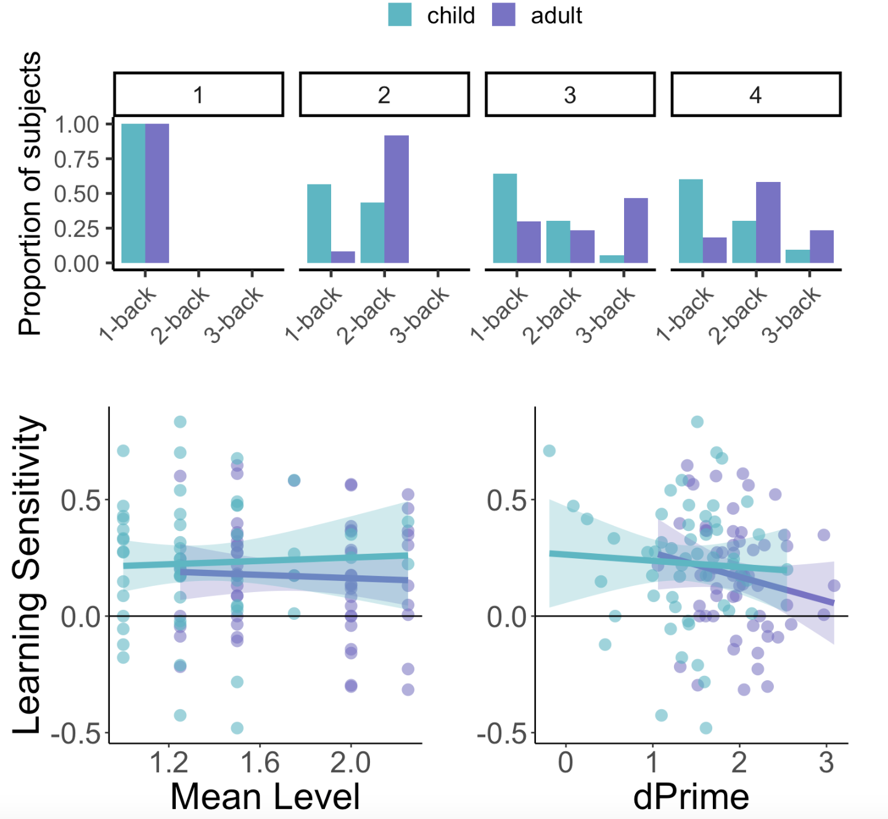

# Analysis code for:
## [Tandoc et al. (2022) Dividing attention hurts learning in adults but not children](10.31234/osf.io/aqw28)

My analysis code in R: including all data cleaning and wrangling (tidyverse, etc.) and statistical analyses reported in the paper (including t-tests, ANOVA, correlations, regressions, linear mixed models). It also contains some code samples used to generate graphs which can be viewed by opening lantern_code_sample.html
 
[Dec 20 2022] All statistical analyses are now reported in the .Rmd file and output is present in the associated .html file (analysis.html). Final public versions of the analysis code. Fullly standardized documentation and the complete dataset will be made available upon publication (currently under review).

